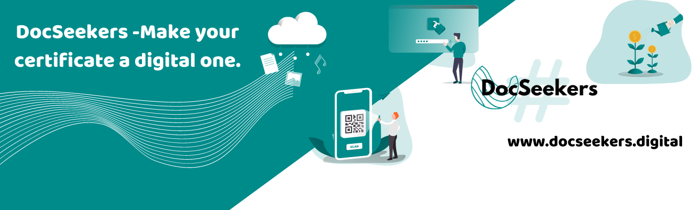
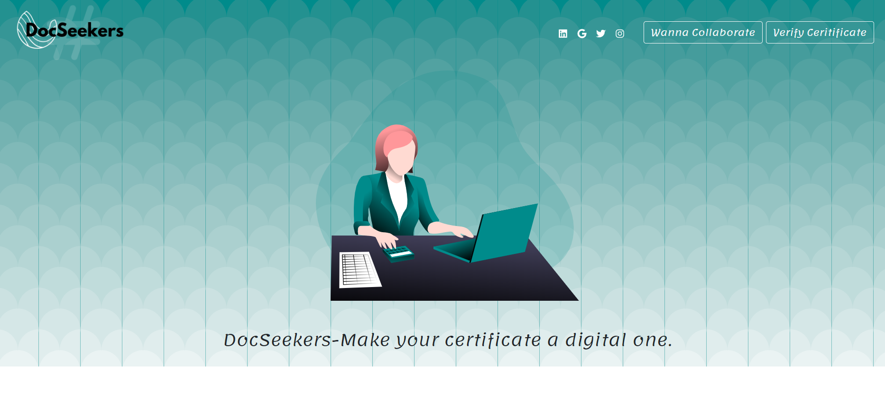
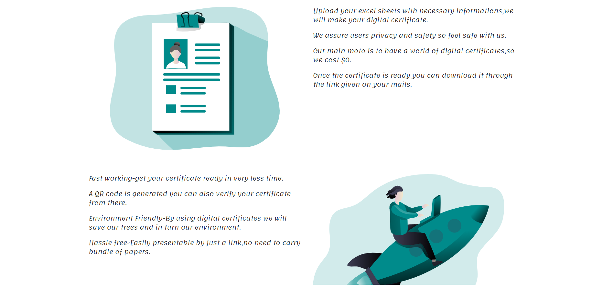
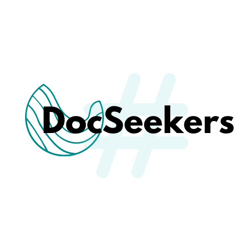

  

<h1 align="center">
  DocSeekers
</h1>

 

## What is DocSeekers?
* DocSeekers-Make your certificate a digital one.

Cryptography itself has been around for a while; what’s interesting is how it’s evolved over time. DocSeekers offers you digital-certificate and even scanning of your documents in an organised manner with no cost. Your security is our priority.WE assure full authentication of your document in an environment-friendly manner. Its so surprising that even in today's world we use printed certificates Most people don’t think of it, but using digital certificates is very easy for end users. Certificates can easily be shown to users outside of your organization (e.g. partners, independent contractors and freelancers) who may need to access your networks. By using docseekers companies can easily save their documents,certificates(by scanning through a QR code) and can even make a new one. There’s always a conflict between increasing security and the costs and burden on end users. Many companies buy certificate from third-parties that increases the cost. Others try to manage digital certificates in-house in an effort to save money, however, protecting certificates has a series of security decisions that are arguably more important than issuing certificates as a whole.

# How to Access Biolink?

* Visit http://docseekers.digital/

# ScreenShots

# How to Use DocSeekers?

* Step-1: Visit http://docseekers.digital/
* Step-2: Click on the Collaborate Button .
* Step-3: Now Fill Collaboration form.
* Step-4: wait for 24 hours we will contact you.

# ThankYou 

<h1 align="center">
   © DocSeekers 2020
</h1>

